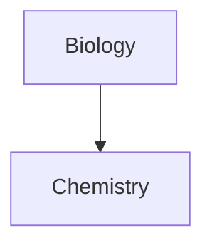

## JavaScript


1. a
2. b

```js
let person = {
	name : "",
	age : ""
}
```


---
> this is quote


---
# Table
```
| First name | Last name |
| ---------- | --------- |
| Max | Planck |
| Marie | Curie |
```

| First name | Last name |
| ---------- | --------- |
| Max        | Planck    |
| Marie      | Curie     |


---


``` html
<div>
	<h1> Hello </h1>
</div>
```

---

- [ ] abc
- [ ] 
- [x] Milk 
- [?] Eggs 
- [-] Eggs
<<<<<<< HEAD
- [ ] 
=======
>>>>>>> 75e64a69fcd5d4819becac353eb1eb09c197b44a



